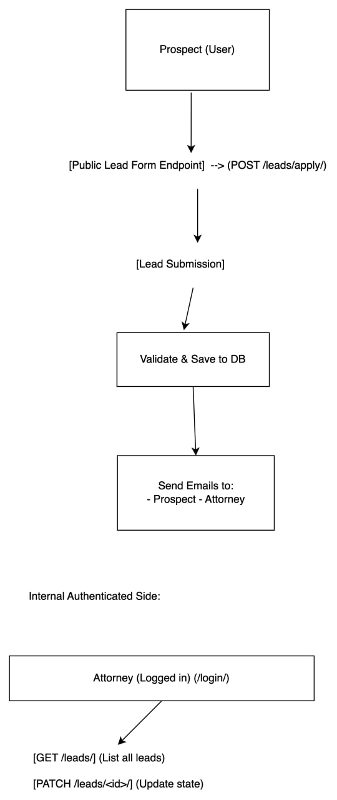

## How to set up project (with Docker)

Give permission to docker script: ```chmod +x ./docker-compose```
Give permission to docker script: ```chmod +x entrypoint.dev.sh```

### Docker compose file

Build and docker up containers: ```docker-compose -f docker-compose.dev.yml up -d --build```

### Use docker-compose file

```./docker-compose makemigrations```
or ```docker-compose -f docker-compose.dev.yml exec web python manage.py makemigrations```

## How to run project locally bash script (Linux, Mac)

### install requirements

```bash
python3 -m venv env
source env/bin/activate
pip install -r requirements/develop.text
```

### create .env file

```bash
cp .env.example .env
```

### create database

```bash
sudo -u postgres psql
CREATE DATABASE django_boilerplate;
CREATE USER django_boilerplate WITH PASSWORD 'django_boilerplate';
ALTER ROLE django_boilerplate SET client_encoding TO 'utf8';
ALTER ROLE django_boilerplate SET default_transaction_isolation TO 'read committed';
ALTER ROLE django_boilerplate SET timezone TO 'UTC';
GRANT ALL PRIVILEGES ON DATABASE django_boilerplate TO django_boilerplate;
\q
```

### set up .env file with your database credentials

```bash
nano .env
```

### run migrations

```bash
python manage.py migrate
```

### run server

```bash
python manage.py runserver
```

## Pre-commit  must be installed for all projects

```bash
pip install pre-commit
pre-commit install
```

# Back-End Checklist

## 1. Environment Configuration:

- [ ] Ensure that the Django project settings are properly configured for the production environment.
- [ ] Set `DEBUG` to `False` in the production settings (`settings.py`).
- [ ] Verify that the `ALLOWED_HOSTS` setting includes the production domain names or IP addresses.

## 2. Security:

- [ ] Secure sensitive data, such as secret keys and database credentials, by storing them in environment variables or a
  secure secrets management system.
- [ ] Implement Cross-Site Request Forgery (CSRF) protection.
- [ ] Require Google reCAPTCHA in login forms.

## 3. Database:

- [ ] Ensure all migrations are correctly created.
- [ ] Optimize database queries for performance.

## 4. Static and Media Files:

- [ ] Collect and compress static files using `collectstatic` and configure their storage.
- [ ] Handle user-uploaded media files securely and efficiently.
- [ ] Compress media files.
- [ ] Create media models for all media.

## 5. Logging and Monitoring:

- [ ] Implement monitoring and alerting using tools like Prometheus, Grafana, Flower, and Sentry (must-have).

## 6. Performance Optimization:

- [ ] Profile and optimize database queries, views, and templates for performance (use `DEBUGTOOLBAR`, `django-silk`).
- [ ] Implement caching mechanisms for frequently accessed data (depends on project).
- [ ] Configure web server settings, such as Gunicorn or Uvicorn, for optimal performance.

## 7. Testing:

- [ ] Conduct integration tests and unit tests.
- [ ] Set up a staging environment that closely mirrors the production environment for testing purposes (if needed).

## 8. Documentation:

- [ ] Ensure that the codebase is well-documented, including comments and docstrings, and add API documentation to
  Swagger.

## 9. Common Coding Requirements:

- [ ] Implement pre-commit hooks.
- [ ] Use appropriate branches like `dev` and `master`.
- [ ] Add search history API.
- [ ] Implement initial notifications.
- [ ] Provide a complete README (including deployment and project setup guide).
- [ ] Use Docker for production deployment.

## 10. Testing the Production Environment:

- [ ] Conduct load testing to ensure the application can handle expected traffic volumes (using Locust.io).

Here is a brief overview of the flow.




Here is swagger url after running the project.
```http://127.0.0.1:8000/swagger/```
